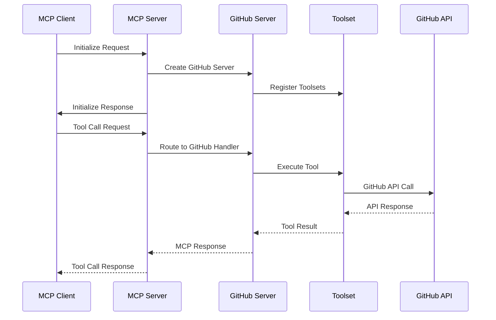
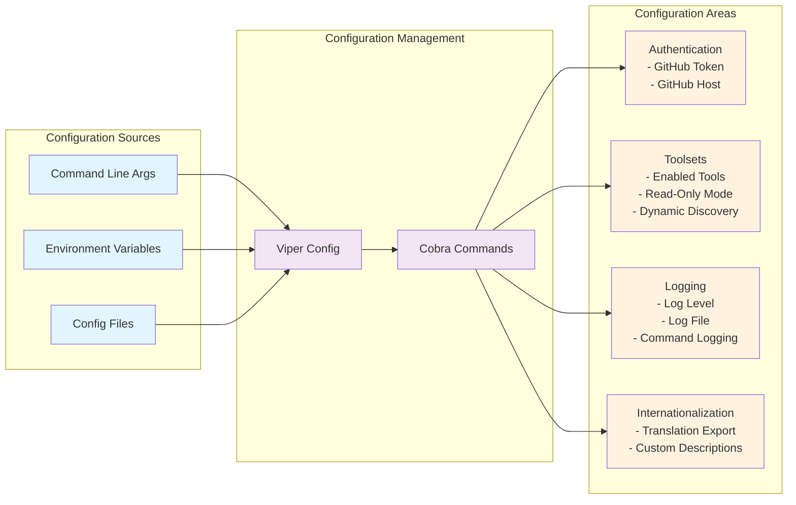
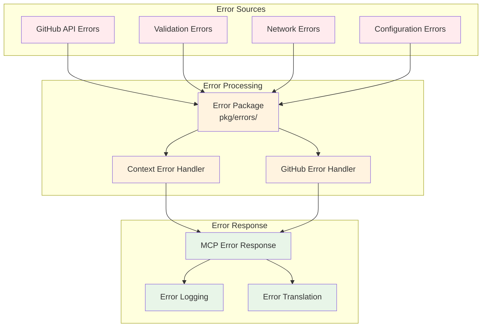

# GitHub MCP Server Architecture

This document provides a comprehensive overview of the GitHub MCP Server architecture, including component relationships, data flow, and system interactions.

## System Overview

The GitHub MCP Server is a Model Context Protocol (MCP) server that provides seamless integration with GitHub APIs. It enables AI tools and applications to interact with GitHub's ecosystem through a structured set of tools, resources, and prompts.

## High-Level Architecture

```mermaid
graph TB
    subgraph "Client Applications"
        VSCODE[VS Code with Copilot]
        CLAUDE[Claude Desktop]
        OTHER[Other MCP Clients]
    end
    
    subgraph "GitHub MCP Server"
        MAIN[Main Entry Point<br/>cmd/github-mcp-server/main.go]
        
        subgraph "Server Layer"
            STDIO[StdIO Server]
            HOOKS[Server Hooks]
            INIT[Initialize Handler]
        end
        
        subgraph "Core MCP Layer"
            MCPSERVER[MCP Server<br/>mark3labs/mcp-go]
            TOOLMGR[Tool Manager]
            RESMGR[Resource Manager]
            PROMPTMGR[Prompt Manager]
        end
        
        subgraph "GitHub Integration Layer"
            GHSERVER[GitHub Server<br/>pkg/github/server.go]
            TOOLSETS[Toolset Groups]
            DYNAMIC[Dynamic Toolsets]
        end
        
        subgraph "API Clients"
            RESTCLIENT[REST Client<br/>go-github/v72]
            GQLCLIENT[GraphQL Client<br/>githubv4]
            RAWCLIENT[Raw Content Client]
        end
        
        subgraph "Toolset Categories"
            CONTEXT[Context Tools]
            ISSUES[Issues Tools]
            PRS[Pull Request Tools]
            REPOS[Repository Tools]
            ACTIONS[Actions Tools]
            SECURITY[Security Tools]
            USERS[User Tools]
            NOTIFICATIONS[Notification Tools]
        end
    end
    
    subgraph "GitHub Services"
        GHAPI[GitHub REST API]
        GHGQL[GitHub GraphQL API]
        GHRAW[GitHub Raw Content]
        GHEC[GitHub Enterprise Cloud]
        GHES[GitHub Enterprise Server]
    end
    
    subgraph "Configuration & Support"
        CONFIG[Configuration<br/>Viper + Cobra]
        LOGGING[Logging<br/>Logrus]
        TRANS[Translations<br/>i18n Support]
        ERRORS[Error Handling]
    end
    
    %% Client connections
    VSCODE --> STDIO
    CLAUDE --> STDIO
    OTHER --> STDIO
    
    %% Main flow
    MAIN --> STDIO
    MAIN --> CONFIG
    STDIO --> MCPSERVER
    STDIO --> HOOKS
    HOOKS --> INIT
    
    %% MCP Server connections
    MCPSERVER --> TOOLMGR
    MCPSERVER --> RESMGR
    MCPSERVER --> PROMPTMGR
    
    %% GitHub integration
    GHSERVER --> MCPSERVER
    TOOLSETS --> GHSERVER
    DYNAMIC --> TOOLSETS
    
    %% API clients
    RESTCLIENT --> GHAPI
    GQLCLIENT --> GHGQL
    RAWCLIENT --> GHRAW
    
    %% Enterprise connections
    RESTCLIENT --> GHEC
    RESTCLIENT --> GHES
    GQLCLIENT --> GHEC
    GQLCLIENT --> GHES
    
    %% Toolset connections
    TOOLSETS --> CONTEXT
    TOOLSETS --> ISSUES
    TOOLSETS --> PRS
    TOOLSETS --> REPOS
    TOOLSETS --> ACTIONS
    TOOLSETS --> SECURITY
    TOOLSETS --> USERS
    TOOLSETS --> NOTIFICATIONS
    
    %% Support connections
    MAIN --> LOGGING
    GHSERVER --> TRANS
    GHSERVER --> ERRORS
    
    %% Tool usage
    CONTEXT --> RESTCLIENT
    ISSUES --> RESTCLIENT
    PRS --> RESTCLIENT
    REPOS --> RESTCLIENT
    ACTIONS --> RESTCLIENT
    SECURITY --> RESTCLIENT
    USERS --> RESTCLIENT
    NOTIFICATIONS --> RESTCLIENT
    
    %% GraphQL usage
    CONTEXT --> GQLCLIENT
    ISSUES --> GQLCLIENT
    PRS --> GQLCLIENT
    REPOS --> GQLCLIENT
    
    %% Raw content usage
    REPOS --> RAWCLIENT
    
    classDef client fill:#e1f5fe
    classDef server fill:#f3e5f5
    classDef github fill:#fff3e0
    classDef config fill:#e8f5e8
    
    class VSCODE,CLAUDE,OTHER client
    class MAIN,STDIO,HOOKS,INIT,MCPSERVER,TOOLMGR,RESMGR,PROMPTMGR,GHSERVER,TOOLSETS,DYNAMIC server
    class GHAPI,GHGQL,GHRAW,GHEC,GHES,RESTCLIENT,GQLCLIENT,RAWCLIENT github
    class CONFIG,LOGGING,TRANS,ERRORS config
```



## Component Details

### 1. Entry Point (`cmd/github-mcp-server/main.go`)
- **Purpose**: Application entry point with CLI interface
- **Framework**: Cobra CLI + Viper configuration
- **Responsibilities**:
  - Parse command line arguments and environment variables
  - Initialize configuration
  - Create and start the MCP server
  - Handle graceful shutdown

### 2. Server Layer (`internal/ghmcp/server.go`)
- **Purpose**: Core MCP server implementation
- **Components**:
  - **StdIO Server**: Handles JSON-RPC communication over stdin/stdout
  - **Server Hooks**: Middleware for request/response processing
  - **Initialize Handler**: Manages client initialization and capabilities

### 3. GitHub Integration Layer (`pkg/github/`)
- **Purpose**: GitHub-specific MCP functionality
- **Components**:
  - **GitHub Server**: Wraps MCP server with GitHub-specific logic
  - **Toolset Groups**: Manages collections of related tools
  - **Dynamic Toolsets**: Runtime toolset discovery and enablement

### 4. API Clients
- **REST Client**: GitHub REST API v3 client (`google/go-github/v72`)
- **GraphQL Client**: GitHub GraphQL API v4 client (`shurcooL/githubv4`)
- **Raw Client**: Direct file content access

### 5. Toolset Categories
Each toolset represents a logical grouping of related functionality:

- **Context**: User and repository context information
- **Issues**: Issue management (create, read, update, comment)
- **Pull Requests**: PR operations (create, merge, review)
- **Repositories**: Repository and file operations
- **Actions**: GitHub Actions workflows and CI/CD
- **Security**: Code scanning and secret protection
- **Users**: User-related operations
- **Notifications**: GitHub notifications management

## Data Flow



## Configuration Architecture



## Toolset Architecture

```mermaid
graph TB
    subgraph "Toolset Management"
        TSG[Toolset Group]
        TSM[Toolset Manager]
        DYNAMIC[Dynamic Discovery]
    end
    
    subgraph "Individual Toolsets"
        subgraph "Context Toolset"
            CTX_TOOLS[Context Tools]
            CTX_RESOURCES[Context Resources]
        end
        
        subgraph "Issues Toolset"
            ISS_TOOLS[Issue Tools]
            ISS_RESOURCES[Issue Resources]
        end
        
        subgraph "Pull Request Toolset"
            PR_TOOLS[PR Tools]
            PR_RESOURCES[PR Resources]
        end
        
        subgraph "Repository Toolset"
            REPO_TOOLS[Repository Tools]
            REPO_RESOURCES[Repository Resources]
        end
        
        subgraph "Actions Toolset"
            ACT_TOOLS[Actions Tools]
            ACT_RESOURCES[Actions Resources]
        end
        
        subgraph "Security Toolset"
            SEC_TOOLS[Security Tools]
            SEC_RESOURCES[Security Resources]
        end
    end
    
    subgraph "Tool Types"
        READ[Read-Only Tools]
        WRITE[Write Tools]
        PROMPTS[Prompts]
    end
    
    TSG --> TSM
    TSM --> DYNAMIC
    
    TSM --> CTX_TOOLS
    TSM --> ISS_TOOLS
    TSM --> PR_TOOLS
    TSM --> REPO_TOOLS
    TSM --> ACT_TOOLS
    TSM --> SEC_TOOLS
    
    CTX_TOOLS --> READ
    CTX_TOOLS --> WRITE
    CTX_TOOLS --> PROMPTS
    
    ISS_TOOLS --> READ
    ISS_TOOLS --> WRITE
    ISS_TOOLS --> PROMPTS
    
    PR_TOOLS --> READ
    PR_TOOLS --> WRITE
    PR_TOOLS --> PROMPTS
    
    REPO_TOOLS --> READ
    REPO_TOOLS --> WRITE
    REPO_TOOLS --> PROMPTS
    
    ACT_TOOLS --> READ
    ACT_TOOLS --> WRITE
    ACT_TOOLS --> PROMPTS
    
    SEC_TOOLS --> READ
    SEC_TOOLS --> WRITE
    SEC_TOOLS --> PROMPTS
    
    classDef mgmt fill:#e1f5fe
    classDef toolset fill:#f3e5f5
    classDef type fill:#fff3e0
    
    class TSG,TSM,DYNAMIC mgmt
    class CTX_TOOLS,ISS_TOOLS,PR_TOOLS,REPO_TOOLS,ACT_TOOLS,SEC_TOOLS toolset
    class READ,WRITE,PROMPTS type
```



## Error Handling Architecture



## Security Architecture

```mermaid
graph TB
    subgraph "Authentication"
        PAT[Personal Access Token]
        OAUTH[OAuth (Remote Only)]
        ENTERPRISE[Enterprise Auth]
    end
    
    subgraph "Authorization"
        SCOPES[GitHub Scopes]
        PERMISSIONS[Repository Permissions]
        READONLY[Read-Only Mode]
    end
    
    subgraph "Security Features"
        TRANSPORT[Secure Transport]
        HEADERS[Security Headers]
        USERAGENT[User Agent]
    end
    
    subgraph "GitHub Hosts"
        DOTCOM[GitHub.com]
        GHEC[GitHub Enterprise Cloud]
        GHES[GitHub Enterprise Server]
    end
    
    PAT --> SCOPES
    OAUTH --> SCOPES
    ENTERPRISE --> SCOPES
    
    SCOPES --> PERMISSIONS
    PERMISSIONS --> READONLY
    
    TRANSPORT --> HEADERS
    HEADERS --> USERAGENT
    
    DOTCOM --> TRANSPORT
    GHEC --> TRANSPORT
    GHES --> TRANSPORT
    
    classDef auth fill:#e1f5fe
    classDef authz fill:#f3e5f5
    classDef security fill:#fff3e0
    classDef host fill:#e8f5e8
    
    class PAT,OAUTH,ENTERPRISE auth
    class SCOPES,PERMISSIONS,READONLY authz
    class TRANSPORT,HEADERS,USERAGENT security
    class DOTCOM,GHEC,GHES host
```

## Deployment Architecture

```mermaid
graph TB
    subgraph "Deployment Options"
        DOCKER[Docker Container]
        BINARY[Native Binary]
        REMOTE[Remote Server]
    end
    
    subgraph "Integration Targets"
        VSCODE[VS Code]
        CLAUDE[Claude Desktop]
        CUSTOM[Custom MCP Host]
    end
    
    subgraph "Configuration Methods"
        ENV_VARS[Environment Variables]
        CLI_FLAGS[Command Line Flags]
        CONFIG_FILE[Configuration File]
    end
    
    subgraph "Communication"
        STDIO[StdIO (JSON-RPC)]
        HTTP[HTTP (Remote)]
    end
    
    DOCKER --> STDIO
    BINARY --> STDIO
    REMOTE --> HTTP
    
    VSCODE --> DOCKER
    VSCODE --> BINARY
    VSCODE --> REMOTE
    
    CLAUDE --> DOCKER
    CLAUDE --> BINARY
    
    CUSTOM --> DOCKER
    CUSTOM --> BINARY
    CUSTOM --> REMOTE
    
    ENV_VARS --> DOCKER
    ENV_VARS --> BINARY
    ENV_VARS --> REMOTE
    
    CLI_FLAGS --> BINARY
    CONFIG_FILE --> BINARY
    
    classDef deploy fill:#e1f5fe
    classDef target fill:#f3e5f5
    classDef config fill:#fff3e0
    classDef comm fill:#e8f5e8
    
    class DOCKER,BINARY,REMOTE deploy
    class VSCODE,CLAUDE,CUSTOM target
    class ENV_VARS,CLI_FLAGS,CONFIG_FILE config
    class STDIO,HTTP comm
```

## Key Design Patterns

### 1. **Modular Toolset Architecture**
- Toolsets are self-contained units of functionality
- Each toolset can be independently enabled/disabled
- Read-only mode filtering at the toolset level

### 2. **Multi-Client Support**
- GitHub.com (public)
- GitHub Enterprise Cloud (GHEC)
- GitHub Enterprise Server (GHES)
- Automatic host detection and URL construction

### 3. **Flexible Configuration**
- Multiple configuration sources (CLI, env vars, files)
- Runtime toolset discovery
- Internationalization support

### 4. **Error Handling Strategy**
- Centralized error processing
- Context-aware error propagation
- Translation-ready error messages

### 5. **Security-First Design**
- Secure authentication methods
- Configurable permission scopes
- Read-only mode for restricted environments

## Future Extensibility

The architecture is designed to support:
- Additional GitHub API endpoints
- New toolset categories
- Alternative communication protocols
- Enhanced security features
- Performance optimizations

## Dependencies

### Core Dependencies
- `github.com/mark3labs/mcp-go`: MCP protocol implementation
- `github.com/google/go-github/v72`: GitHub REST API client
- `github.com/shurcooL/githubv4`: GitHub GraphQL API client
- `github.com/spf13/cobra`: CLI framework
- `github.com/spf13/viper`: Configuration management
- `github.com/sirupsen/logrus`: Structured logging

### Testing Dependencies
- `github.com/stretchr/testify`: Test assertions and mocking
- `github.com/migueleliasweb/go-github-mock`: GitHub API mocking

This architecture provides a scalable, maintainable foundation for GitHub-MCP integration while maintaining flexibility for future enhancements and extensibility.
